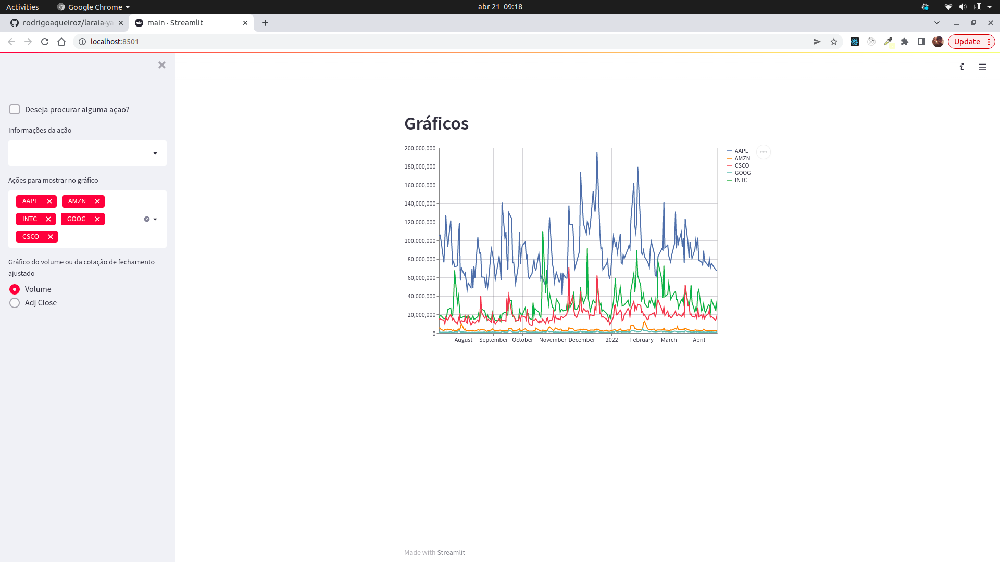
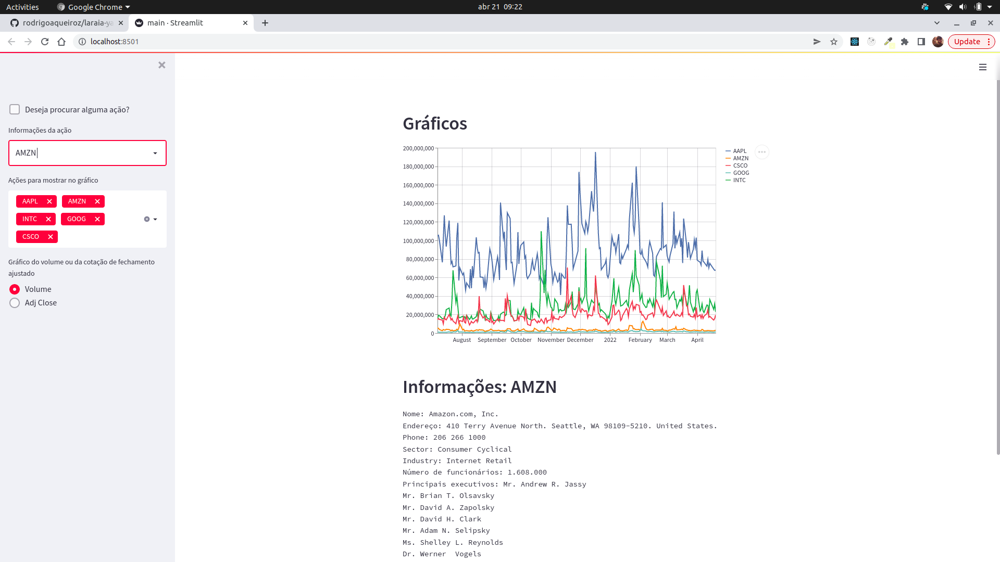
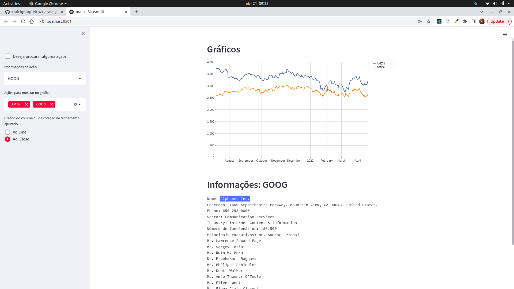
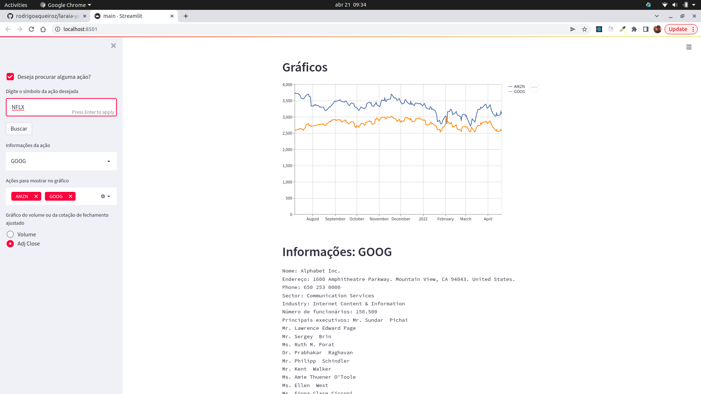
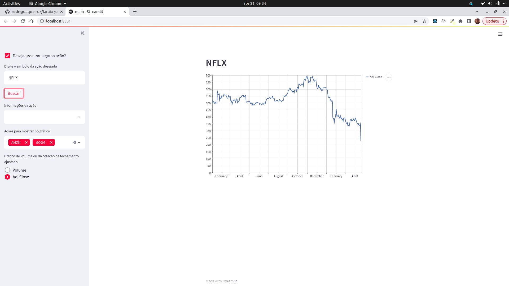
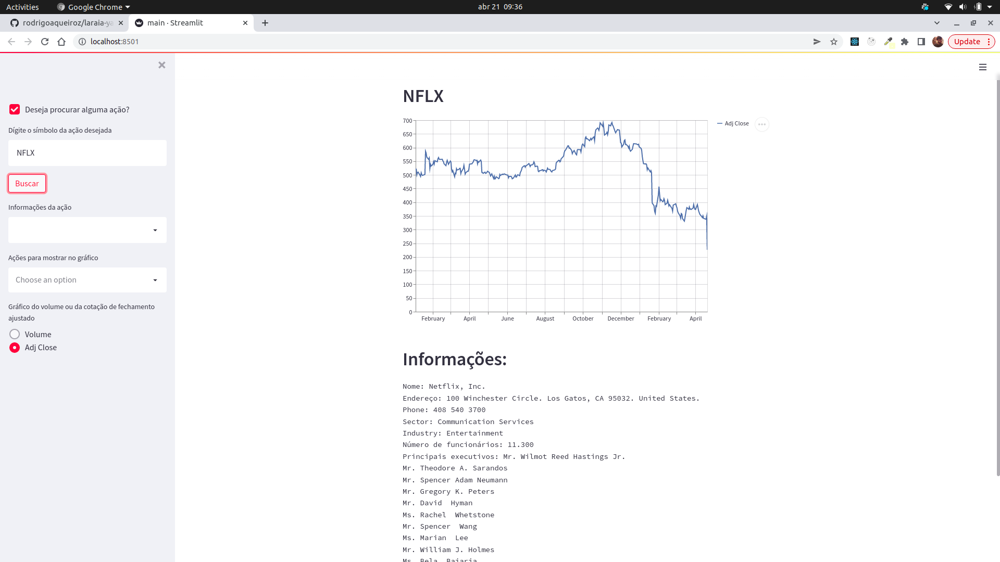
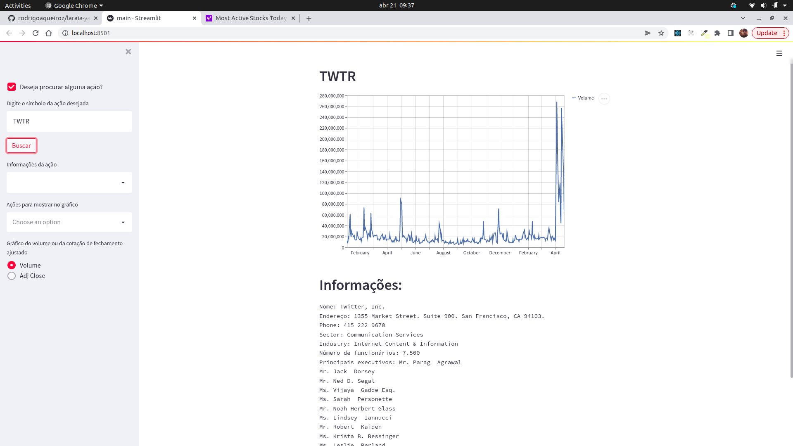

# Raspador de dados - Yahoo Finance!

---

# Sumário

- [Habilidades](#habilidades)
- [Descricao](#descricao)
- [Como desenvolver](#como-desenvolver)
- [Prints](#prints)
- [Deploy](#deploy)
- [Contatos](#contatos)
---

# Habilidades

- Utilizar o terminal interativo do Python;
- Escrever seus próprios módulos e importá-los em outros códigos;
- Aplicar técnicas de raspagem de dados;
- Extrair dados de conteúdo HTML;

---

# Descrição

Este desafio consiste na obtenção de dados financeiros na internet para posterior processamento e análise. O intuito deste desafio é testar sua capacidade de compreender uma série de descrições de funcionalidades de um sistema e codificar adequadamente a solução.

**O desafio consiste das seguintes etapas:**

Dado um determinado conjunto ticker ou símbolo de uma ação, o sistema precisa obter dados financeiros do site Yahoo Finance referentes àqueles ticker. Os tickers são: AAPL, AMZN, INTC, GOOG, CSCO. Informações a serem obtidas:

***1.*** Informações da empresa:
a. Nome completo da empresa
b. Endereço completo da empresa
c. Telefone
d. Setor
e. Indústria
f. Número de funcionários
g. Nome dos principais executivos

***2.*** Obter dados sobre o valor ajustado de fechamento das ações dos últimos 200 dias de cada ticker;

***3.*** Obter dados sobre o volume de ações negociados nos últimos 200 dias de cada ticker;

***4.*** Processar e manipular os dados obtidos para um formato de dado fácil de ser processado;

***5.*** Apresentar em um mesmo gráfico, as informações de preço de cada ticker ao longo do tempo, mas somente o último dia de cada mês;

***6.*** Implementar uma interface Shiny para apresentar os gráficos criados nas tarefas 4 e 5;

***7.*** O usuário deve ter a opção de escolher se ele deseja visualizar ou o preço das ações ou o volume negociado.

***Extras:*** pense em maneiras de fazer com que as tarefas funcionem também com o input de qualquer ticker. Exemplo: Na interface web, um campo de entrada de texto solicita o ticker desejado e seu sistema faz a busca no yahoo finance, obtém e trata os dados e apresenta os gráficos para o usuário.

---

# Como desenvolver

1. **clone o repositório**
```bash
git clone git@github.com:rodrigoaqueiroz/laraia-yahoo-finance.git
```
- Entre na pasta do repositório que você acabou de clonar:
```bash
cd laraia-yahoo-finance
```

2. **crie o ambiente virtual**

```bash
$ python3 -m venv .venv
```

3. **ative o ambiente virtual**

```bash
$ source .venv/bin/activate
```

4. **instale as dependências no ambiente virtual**

```bash
$ python3 -m pip install -r requirements.txt
```

5. **Para rodar o streamlit**

```bash
$ streamlit run main.py
```
A aplicação rodará por default na porta 8501

O arquivo `requirements.txt` contém todas as dependências que foram utilizadas no projeto.

---

# Prints

<details>
  <summary>Clique para ver as imagens</summary>
  







</details>

---

# Deploy

O deploy foi realizado no Heroku, para acessar clique <a href='https://laraia-challenge-raqueiroz.herokuapp.com/'> AQUI </a>

---
# Contatos

<div style="display: flex; align-items: center; justify-content: space-between;">
  <div>
    <div style="display: flex; align-items: center;">
       <a href='https://www.linkedin.com/in/rodrigoandradequeiroz/'> https://www.linkedin.com/in/rodrigoandradequeiroz/
      </a>
    </div>
    <br/>
    <div style="display: flex;align-items: center;">
       
      <a href='https://github.com/rodrigoaqueiroz'>
      https://github.com/rodrigoaqueiroz
      </a>
    </div>
    <br/>
    <div style="display: flex;align-items: center;">
      </img>
      <a href="mailto:rodrigoandradequeiroz@gmail.com">rodrigoandradequeiroz@gmail.com</a>
    </div>

---

